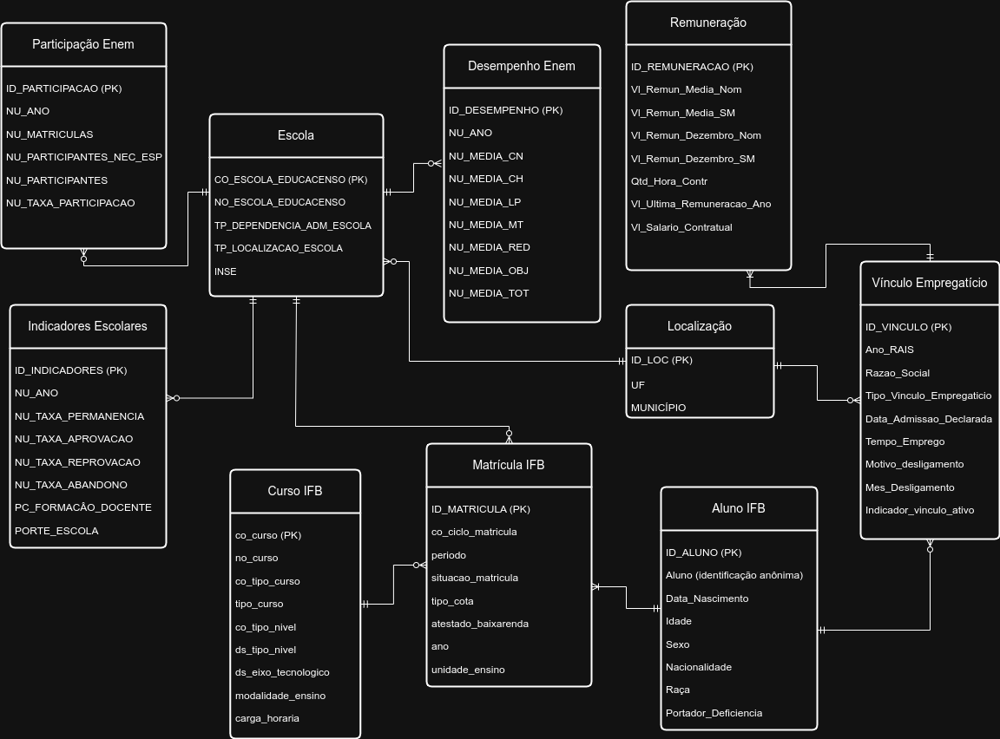

# Projeto de Banco Relacional - MC536

## Visão Geral
Alunos participantes:
- Felipe Rocha Verol (RA: 248552)
- Lucas Bellusci D'Andréa (RA: 206009)
- Theo Maceres Silva (RA: 220825)

Esse é um repositório para o segundo projeto da disciplina MC536, que envolve projetar um banco de dados não relacional baseado no primeiro projeto, populá-lo e fazer 5 consultas não triviais.
Para essa tarefa, utilizamos o DuckDB, pois nosso banco deve priorizar consultas rápidas, visto que não exige inserção de novos dados.

## Datasets
Foram usados os seguintes datasets para o projeto:
- [MICRODADOS_ENEM_ESCOLA.csv](dados/tratados/MICRODADOS_ENEM_ESCOLA.csv): relaciona escolas, de diferentes locais, com seus índices escolares e desempenho no ENEM em cada participação.
- [mundo_trabalho.csv](dados/tratados/mundo_trabalho.csv): contém dados de alunos e ex-alunos do Instituto Federal de Brasília sobre suas matrículas em diferentes cursos e sobre seus vínculos empregatícios.    

OBS: os datasets em formato CSV estão compactados dentro de arquivos ZIP

## Modelos Conceitual, Relacional e Físico
Aqui estão os modelos criados para o melhor entendimento de como deve ser o funcionamento do banco de dados:

### Modelo Conceitual
 

### Modelo Lógico

### Modelo Físico
O SQL do modelo físico está no reposítorio, podendo ser encontrado no diretório [modelos/modelo_fisico_duckdb_v2.sql](modelos/modelo_fisico_duckdb_v2.sql).

## Explicação das principais tabelas
Para esse projeto, era necessário construir o menor número possível de tabelas para evitar agregações e otimizar as consultas. Assim, a melhor forma encontrada para organizar os dados foi através de duas tabelas:
- dim_escola_indicadores_anuais: contém os dados e colunas do dataset [MICRODADOS_ENEM_ESCOLA.csv](dados/tratados/MICRODADOS_ENEM_ESCOLA.csv)
- fato_aluno_trajetoria: contém os dados e colunas do dataset [mundo_trabalho.csv](dados/tratados/mundo_trabalho.csv)

## Como testar

### 1. Criar o banco
Para criar o banco, é necessário ter o módulo do DuckDB para Python instalado. Com isso, basta executar o script [/scripts_insercao/00_criar_banco.py](00_criar_banco.py). Lembre-se, se já existir um arquivo chamado 'BancoNaoRelacional.db' na pasta do projeto, apague-o antes de executar esse script, pois pode causar incompatibilidades.

### 2. Popular o banco
Agora, para popular o banco, é necessário executar o script [/scripts_insercao/01_inserir_dados.py](01_inserir_dados.py). Dessa forma, o banco já está criado e populado.

### 3. Executar as consultas
Para executar as queries, basta acessar o notebook [/queries_view.ipynb](queries_view.ipynb). Lá, todas as queries podem ser executadas e testadas, uma a uma.

## Consultas
### - [Query 1](queries/query1.sql): Desempenho Escolar e Remuneração de Egressos do IFB
Objetivo: Avaliar a correlação entre o desempenho no ENEM dos alunos do Instituto Federal de Brasília (IFB) e os valores de remuneração média e salário contratual obtidos por eles ao ingressarem no mercado de trabalho, considerando o ano de admissão como referência temporal comum.

### - [Query 2](queries/query2.sql): Remuneração e Desempenho no ENEM por Localidade e Ano
Objetivo: Analisar a relação entre a remuneração média de egressos no mercado de trabalho formal e o desempenho médio dos estudantes no ENEM, segmentado por município e ano.

### - [Query 3](queries/query3.sql): Qualidade Educacional e Condições de Trabalho por Localidade
Objetivo: Investigar a relação entre o desempenho médio no ENEM dos municípios e as condições contratuais dos vínculos empregatícios ativos nesses locais, considerando remuneração média, carga horária e número de escolas participantes.

### - [Query 4](queries/query4.sql): Análise de Relação entre Abandono Escolar e Tempo de Emprego
Objetivo: Investigar se existe relação entre a taxa de abandono escolar no IFB e o tempo de permanência dos alunos no primeiro emprego formal, considerando os ingressantes entre 2009 e 2015. A análise classifica os níveis de abandono tanto no ambiente escolar quanto no empregatício, permitindo identificar possíveis padrões de evasão e sua influência na trajetória profissional dos egressos.
 
### - [Query 5](queries/query5.sql): Mobilidade Geográfica e Remuneração de Egressos
Objetivo: Analisar os alunos do IFB que estudaram em cursos presenciais e que, após formados, conseguiram empregos com remuneração anual igual ou superior a R$1000 fora do município de sua escola. O foco é identificar padrões de migração geográfica para o trabalho, relacionando a última remuneração conhecida com o curso frequentado e o deslocamento entre município de estudo e município de emprego.

